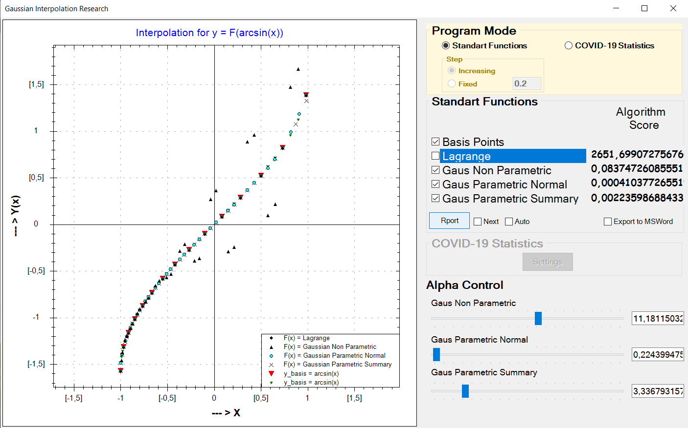
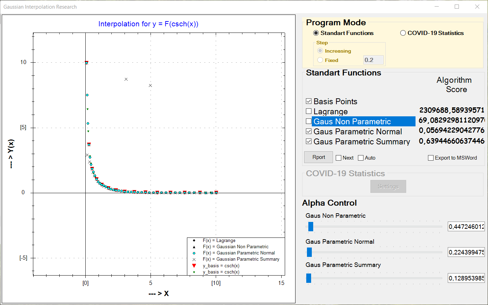
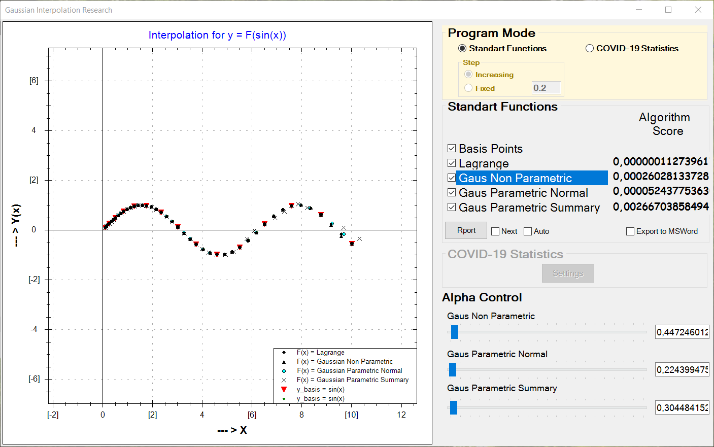
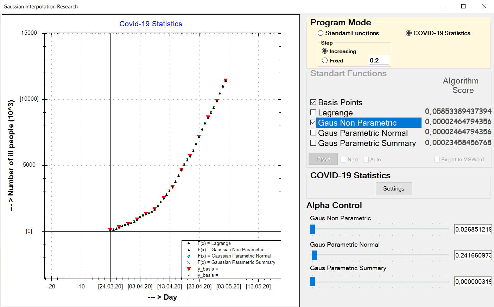
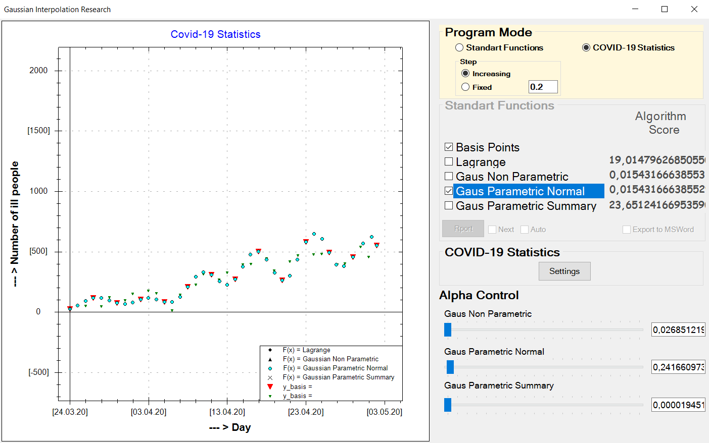

# GaussianIterpoalationDemo
Demonstrate four ways of Interpolation methods: 
 - Lagrange and three 
 - Gaussian Non Parametric
 - Gaussian Parametric
 - Gaussian Parametric Summary

### Screenshots of Interpolation

#### Arcsin(x)

#### Csch(x)

#### Sin(x)

### Test this method on COVID19 Statistics
Statisctics have taken from [here](https://pomber.github.io/covid19/timeseries.json")

#### Total sick

#### Total sick per day
